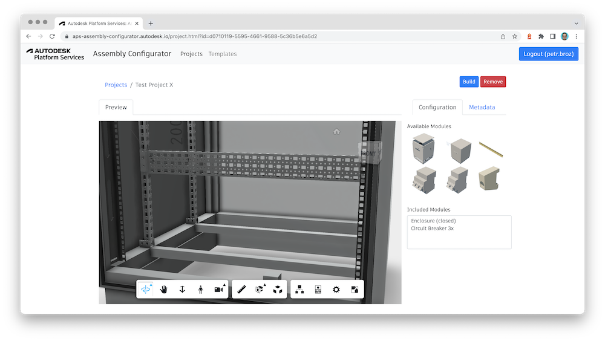

# Assembly Configurator

A simple, generic assembly configurator built using [Autodesk Platform Services](https://aps.autodesk.com). The application has two main interfaces: _template_ authoring and _project_ authoring. Template authoring involves selecting a set of 3D models that can be assembled together, and defining their connecting (snapping) points. During project authoring the user then selects a specific template, drag&drops invididual models and snaps them together, and saves the result.

Live demo: https://aps-assembly-configurator.autodesk.io

## Development

### Prerequisites

- [Node.js](https://nodejs.org/en/download) (recommended version: LTS), and [yarn](https://yarnpkg.com)
- [APS credentials](https://forge.autodesk.com/en/docs/oauth/v2/tutorials/create-app)
- Terminal (for example, [Windows Command Prompt](https://en.wikipedia.org/wiki/Cmd.exe), or [macOS Terminal](https://support.apple.com/guide/terminal/welcome/mac))

### Running locally

- clone this repository
- install dependencies: `yarn install`
- setup env. variables listed in [config.js](./config.js)
- if not available, create the Design Automation pipeline: `node tools/setup-inventor-pipeline.js`
- if not available, create a sample template: `node tools/setup-sample-template-przemek.js`
- run the server `yarn start`
- visit http://localhost:3000

### Folder structure

- _shared_ - basic CRUD operations on "templates" and "projects", used by the server and command-line tools
- _plugins_ - an Inventor plugin used to assemble parts
- _server_ - a simple Express.js server providing a web interface for the configurator
  - _public_ - client side assets
  - _routes_ - server side endpoints
- _tools_ - helper scripts for bootstrapping the pipeline, creating sample templates, etc.
  - _templates_ - a couple of design files (Inventor, SolidWorks, STEP) for sample templates

### Asset preparation

When preparing your own 3D assets for this application, make sure that their origin is
setup properly. When you are dropping a part into an assembly, the application logic
will always try and find a "connector point" (on modules that are already in the assembly)
that's closest to your mouse cursor, and it will move your part's **origin** to that location.

## Troubleshooting

Submit your question via [APS Support Form](https://aps.autodesk.com/en/support/get-help).

## License

This sample is licensed under the terms of the [MIT License](http://opensource.org/licenses/MIT).
Please see the [LICENSE](LICENSE) file for more details.

## Authors

- Petr Broz ([@ipetrbroz](https://twitter.com/ipetrbroz)), Developer Advocate
- Adam Nagy ([@AdamTheNagy](https://twitter.com/AdamTheNagy)), Developer Advocate
